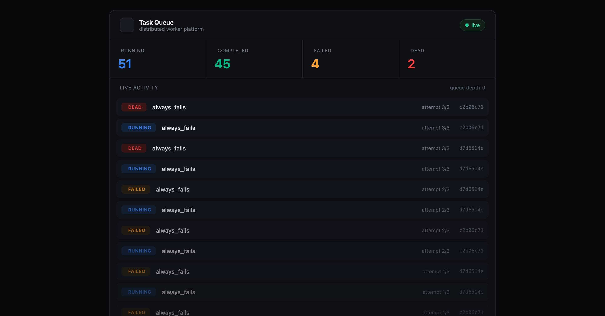

# Distributed Task Queue

A task queue built from scratch — the kind of thing Celery or Sidekiq gives you, but assembled by hand so I could actually understand how the pieces fit. You POST a job to an API, it lands in a Redis queue, and a pool of workers picks it up, runs it, and records the result in Postgres. If a job fails, it retries with backoff; if it keeps failing, it goes to a dead-letter queue instead of vanishing.

I built this to learn distributed systems properly rather than just reading about them. Most of the interesting problems only show up once you have separate processes talking to each other — what happens when a worker dies mid-job, how do you not run the same job twice, how do you add capacity without rewriting anything. This project is me working through those.

There's a live dashboard too, so you can watch tasks move through the system in real time.



## What it does

- **REST API** to submit and check on tasks (FastAPI)
- **Postgres** as the source of truth — every task and its full history lives here
- **Redis** as the queue — holds work in motion, decoupling the API from the workers
- **Concurrent workers** that run up to N tasks at once and shut down gracefully instead of dropping in-flight work
- **Retries with exponential backoff**, so a flaky downstream gets a few more chances before a task is given up on
- **Dead-letter queue** for tasks that exhaust their retries — nothing fails silently
- **Idempotency keys** so a client retrying the same request doesn't create duplicate work
- **A real-time dashboard** over WebSockets showing tasks and status counts as they happen

## How it's put together

The API, the workers, and the dashboard are separate processes. They only share Redis and Postgres, which is the whole point — you can run more workers without touching anything else.

```
  client → API (FastAPI) → Redis queue → workers → Postgres
                                 │                     │
                                 └──── events ─────────┘
                                          │
                                    WebSocket → dashboard
```

The code is layered so each part has one job: routes handle HTTP, services hold the business logic, repositories are the only thing that touches SQL. It made the reliability work (retries, idempotency) much easier to reason about, because "when do we retry" and "how do we write to the database" live in different files.

Task types are just async functions in a handler registry — adding a new kind of job is a few lines.

## Running it

You'll need Postgres and Redis. I ran them locally with Homebrew:

```bash
brew services start postgresql@16
brew services start redis
```

Set up the environment (I used conda, but a venv works too):

```bash
conda activate taskqueue
cd backend
pip install -r requirements.txt
```

Copy `.env.example` to `.env` and adjust if your database credentials differ, then run the migrations:

```bash
alembic upgrade head
```

Now start the three pieces, each in its own terminal.

API:
```bash
uvicorn app.main:app --reload
```

A worker:
```bash
python -m app.workers.worker
```

Then open the dashboard at `http://localhost:8000/dashboard` and throw some work at it:

```bash
curl -X POST http://localhost:8000/tasks \
  -H "Content-Type: application/json" \
  -d '{"task_type": "send_email", "payload": {"to": "you@example.com"}}'
```

You'll see it appear in the dashboard and get processed. There's also an `always_fails` task type if you want to watch the retry-and-dead-letter path in action.

## Scaling

The reason the API and workers are separate processes is so you can run more workers when you need more throughput, with no code change. Each worker pulls from the same Redis queue, and Redis hands each task to exactly one of them.

I measured it with the benchmark script (`scripts/benchmark.py`), running 60 fixed-size tasks:

| Workers | Time | Throughput |
|--------:|-----:|-----------:|
| 1 | 4.97s | 12.1 tasks/sec |
| more | 2.91s | 20.7 tasks/sec |

It doesn't scale perfectly linearly, and that's expected — each worker is already running several tasks concurrently, and on one laptop you hit CPU and database limits fairly quickly. On real hardware with more cores you'd see it climb further. But the shape is the point: add workers, get more throughput, change nothing.

```bash
python scripts/benchmark.py 60
```

## Built with

Python 3.12, FastAPI, PostgreSQL, Redis, SQLAlchemy 2.x (async), Alembic, asyncio, WebSockets.

## What I'd add next

Metrics and monitoring with Prometheus and Grafana is the obvious next step — the worker already emits events on every state change, so wiring up a `/metrics` endpoint and graphing throughput and queue depth over time wouldn't be a big lift. I scoped it out for now to keep this focused. Beyond that: priority queues, scheduled/delayed jobs, and a proper test suite.
